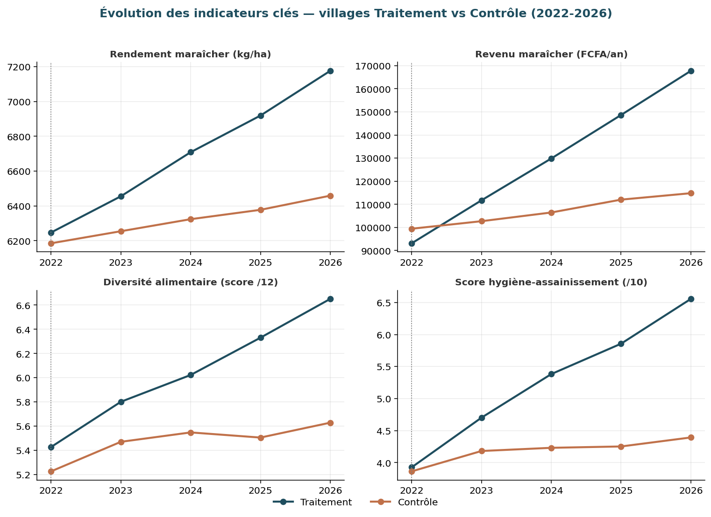

# Évaluation d'impact — Projet de production maraîchère, région de Sikasso (Mali)


Pipeline complet d'évaluation d'impact de la génération d'un panel de suivi à la mesure
statistique de l'effet net d'un projet de production maraîchère combinant **formation
technique au maraîchage**, **démonstrations culinaires / nutrition** et **sensibilisation
hygiène-assainissement**, dans la région de Sikasso (Mali).

> ⚠️ **Jeu de données synthétique.** Ce dépôt a été conçu comme démonstration méthodologique
> et technique (design d'évaluation, gestion de panel, calcul DID, régression, visualisation).
> Les chiffres ne décrivent pas un projet réel remplacez `data/raw/` par des données de
> terrain pour un usage opérationnel.

## Design d'évaluation

- **Quasi-expérimental à villages appariés** : 4 paires de villages (1 Traitement / 1 Contrôle
  par cercle: Sikasso, Bougouni, Koutiala, Kadiolo).
- **Panel de 400 ménages** suivis sur **5 vagues annuelles** (2022 = baseline, 2026 = endline),
  avec gestion réaliste de l'attrition (ménages « perdus de vue »).
- **Méthode d'estimation de l'impact** : double différence (DID) descriptive, confirmée par une
  régression en panel avec erreurs standard **clusterisées au niveau du village** :

  ```
  Y_ivt = β0 + β1·Traitement_v + β2·Post_t + β3·(Traitement_v × Post_t) + ε_ivt
  ```

  où **β3** est le coefficient d'intérêt : l'effet net attribuable au projet, une fois neutralisées
  les tendances contextuelles communes aux deux groupes (pluviométrie, prix du marché, etc.).

## Structure du dépôt

```
sikasso-maraicher-impact-evaluation/
├── src/
│   ├── generate_data.py        # génère le panel synthétique (menages/panel/formations)
│   └── impact_analysis.py      # DID descriptif + régression clusterisée + graphiques
├── data/
│   ├── raw/                    # menages.csv, panel.csv, formations.csv
│   └── processed/              # classeur Excel livrable (multi-onglets, formules DID)
├── notebooks/
│   └── analyse_impact.ipynb    # notebook exécuté, narratif + code + graphiques
├── reports/
│   ├── tableau_impact_did.csv
│   ├── regression_did_resultats.csv
│   └── figures/                # graphiques exportés en .png
├── requirements.txt
└── LICENSE
```

## Reproduire l'analyse

```bash
git clone https://github.com/<votre-compte>/sikasso-maraicher-impact-evaluation.git
cd sikasso-maraicher-impact-evaluation
python3 -m venv .venv && source .venv/bin/activate
pip install -r requirements.txt

python src/generate_data.py       # régénère data/raw/*.csv
python src/impact_analysis.py     # régénère reports/*.csv et reports/figures/*.png

jupyter notebook notebooks/analyse_impact.ipynb   # exploration interactive
```

## Résultats clés (régression DID, erreurs clusterisées par village, N = 764)

| Indicateur | Effet net (β3) | Erreur std. | p-value | Signif. |
|---|---:|---:|---:|:---:|
| Rendement maraîcher (kg/ha) | +655.1 | 38.8 | <0.01 | *** |
| Revenu maraîcher (FCFA/an) | +59 248 | 2 302 | <0.01 | *** |
| Revenu total du ménage (FCFA/an) | +60 512 | 9 145 | <0.01 | *** |
| Diversité alimentaire (score /12) | +0.82 | 0.20 | <0.01 | *** |
| Consommation de légumes (j/sem) | +1.51 | 0.21 | <0.01 | *** |
| Accès à une latrine améliorée (%) | +50.2 pts | 6.9 pts | <0.01 | *** |
| Lavage des mains aux moments clés (%) | +39.4 pts | 5.3 pts | <0.01 | *** |
| Score hygiène-assainissement (/10) | +2.10 | 0.16 | <0.01 | *** |
| Connaissances nutritionnelles (/10) | +2.50 | 0.24 | <0.01 | *** |
| Mois de soudure alimentaire | −1.00 | 0.16 | <0.01 | *** |

*** p<0.01, ** p<0.05, * p<0.10. Détail complet : [`reports/regression_did_resultats.csv`](reports/regression_did_resultats.csv).

### Tendances Traitement vs Contrôle (2022-2026)



### Effet net du projet par indicateur


### Rétention du panel


## Limites méthodologiques à garder en tête

- **Hypothèse des tendances parallèles** : la validité causale du DID suppose que Traitement et
  Contrôle auraient évolué de façon similaire en l'absence du projet à tester (ex. tendances
  pré-baseline si disponibles) avant toute conclusion définitive.
- **Attrition différentielle** : le taux de perte de vue est légèrement plus élevé en Contrôle ;
  une analyse de sensibilité (bornes de Lee, pondération inverse de probabilité) est recommandée.
- **Randomisation absente** : les villages n'ont pas été assignés aléatoirement au traitement
  (design quasi-expérimental) envisager un appariement sur score de propension (PSM) en
  complément si le risque de sélection est jugé important.
- **Données synthétiques** : les résultats ci-dessus servent à valider le pipeline technique, pas
  à documenter un impact réel.

## Auteur

**Amadou Bamia (Ando)**  | Senior MEAL & ICT4D Specialist**
(Bamako, Mali). Conseil en systèmes de suivi-évaluation et de données pour les organisations de
développement au Sahel.

## Licence

Ce projet est sous licence [MIT](LICENSE).
